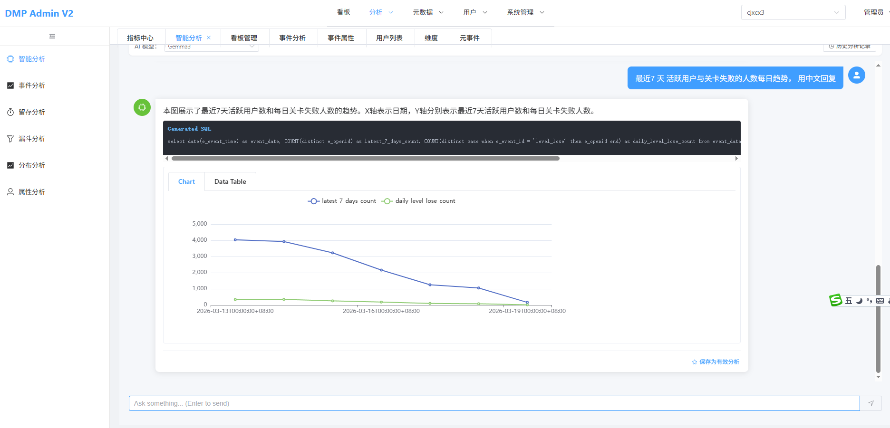
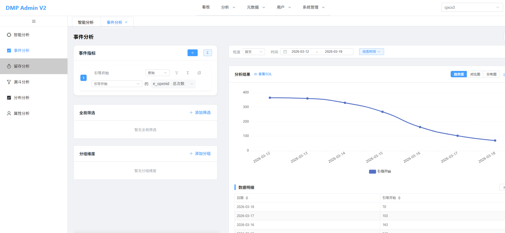
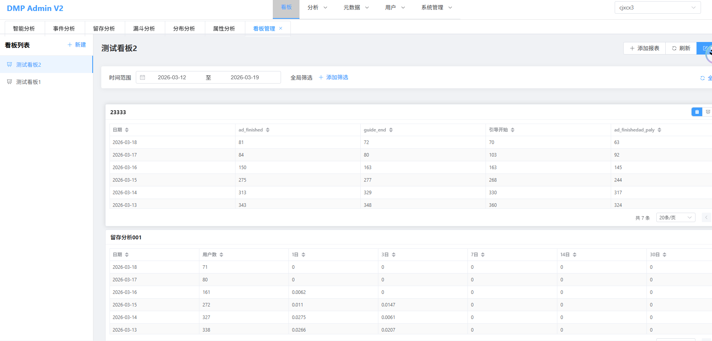

# DMP Admin V2 - 行为分析平台

`dmp_admin_v2` 是一个基于 **Apache Doris** 的全栈行为分析平台，集成了管理端、分析 API 和高效的数据链路，旨在为企业提供深度、实时的用户行为洞察。

## 项目概述

本项目不仅是一个简单的管理系统，更是一个集成了现代大数据分析与 AI 智能插件的综合性解决方案。通过高性能的 Doris 向量存储与 OLAP 查询能力，支持海量埋点数据的秒级查询与多维分析。

## 核心功能

- **📊 多维事件分析**：支持自定义指标与维度，灵活探索用户行为规律。
- **🌪️ 漏斗分析**：精准追踪用户在关键路径上的转化与流失，优化业务流程。
- **📈 留存分析**：衡量产品粘性与用户生命周期平衡，识别高价值用户群体。
- **🛡️ 属性与分布分析**：深度解剖用户画像，支持复杂的人群分层。
- **📅 数据看板**：可交互的全局视图，支持漏斗、留存、路径等多类型图表展示。
- **📑 日志与用户详情**：追踪单一用户的全链路行为记录，排查异常及理解用户习惯。
- **🤖 AI 智能集成**：
    - 集成主流大模型（如 OpenAI, DeepSeek, Ollama 本地）进行语义化 SQL 生成。
    - 智能元数据上下文感知，降低非技术人员的使用门槛。
    - 后台可配置的模型管理与连通性测试。

## 技术栈

### 前端 (Admin Web)
- **框架**：Vue 3 + TypeScript
- **构建工具**：Vite
- **UI 组件库**：Element Plus
- **图表引擎**：Apache ECharts (用于复杂的数据可视化)
- **状态管理**：Pinia

### 后端 (Analytics API)
- **核心语言**：Golang (v1.25.0+)
- **Web 框架**：Gin
- **数据库**：
    - **Apache Doris**：作为核心 OLAP 引擎处理亿级数据。
    - **MySQL** (GORM)：管理系统元数据、用户权限与 AI 配置。
    - **Redis**：缓存热点查询、Session 和 RBAC 权限数据。
- **AI 交互**：通过 OpenAPI 标准集成多种大模型 API。

## 产品展示





## 项目结构

```text
dmp_admin_v2/
├── frontend/        # 前端管理台源码 (Vue3 + TS)
├── backend/         # 后端 API 与核心逻辑 (Go)
├── docs/            # 设计文档、产品说明、SQL 脚本及示例图片
└── README.md        # 项目主说明文档
```

---
*注：本项目持续迭代中，更多高级分析组件及 AI 功能正逐步完善。*
