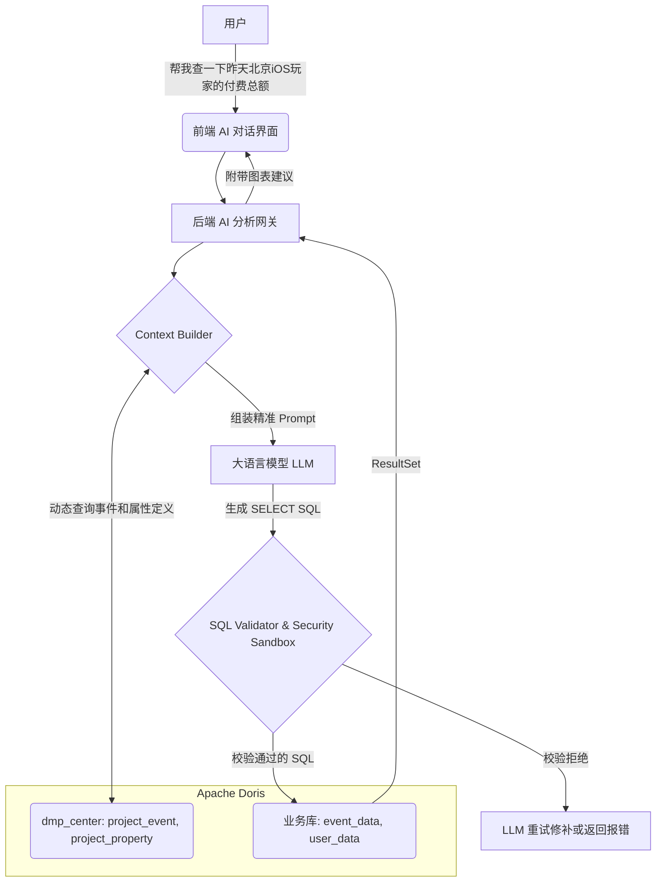

# AI 数据分析：需求与方案概述

## 1. 业务背景与愿景
在传统的用户行为分析系统之外，许多业务人员常常面临**高度定制化**、长尾分布的数据计算需求。配置图表通常存在较高的学习成本，而使用 SQL 直接查询则要求具备技术门槛。

**本方案目标**：为系统引入“对话式数据分析”（Chat2SQL / Data+AI）能力。用户可以通过自然语言输入查询需求，系统利用大语言模型将自然语言翻译为可执行的 SQL，最后在底层引擎（Apache Doris）上执行并可视化结果。

## 2. 核心架构设计 (Native Doris 方案)

由于我们系统的业务数据底座和**元管理数据（`dmp_center`）均统一存储于 Apache Doris**，这使得数据驱动 AI（Data+AI）获得了极大的物理架构优势：
**零外部依赖同步**：后端 Context Builder 可以直接通过查询 Doris `dmp_center` 库来组装实时的 Schema 和属性定义，不用担心缓存不一致。

## 3. 后续文档目录
为便于落地开发，本设计方案拆分为以下几个子篇章：
- `02-元数据上下文设计.md`：详细阐述如何通过查询 `dmp_center` 来动态组装精准的实体结构。
- `03-SQL生成与安全执行.md`：后端接收到 LLM 的 SQL 后，如何实现对 Doris AST 解析拦截沙箱。
- `04-前端交互与可视化.md`：前端如何渲染流式气泡以及从 LLM 的 JSON 配置中自动包裹 ECharts。
- `05-AI大模型接入设计.md`：第三方大语言模型（如 DeepSeek/Qwen 等）的选型、与后端网关的接入方式（REST API vs MCP）及高可用配置。
