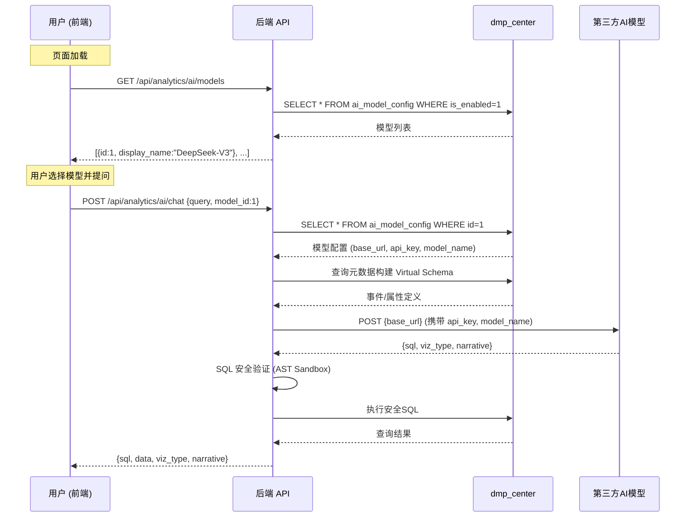

# 系统 AI 模型配置与多模型管理设计

本文档描述系统如何支持配置和管理多个第三方 AI 大模型提供商（如 OpenAI、DeepSeek、通义千问等），并允许用户在 **智能分析页面** 按需切换模型。

## 1. 设计目标

| 目标 | 说明 |
|------|------|
| **多模型配置** | 系统管理员可在后台配置多个 AI 模型提供商（API Key、Endpoint、模型名称等） |
| **前端可选** | 用户在 `/analytics/ai` 页面对话时可从已配置模型中选择一个使用 |
| **统一协议** | 所有模型均使用兼容 OpenAI Chat Completion 的 REST API 协议，统一调用接口 |
| **运行时切换** | 模型配置存储在数据库中（`dmp_center`），支持动态新增/修改/停用，无需重启服务 |
| **安全隔离** | API Key 等敏感信息仅在后端存储和使用，前端只获取模型 ID 与显示名称 |

## 2. 支持的模型提供商

以下为推荐支持的主流大模型，均兼容 OpenAI Chat Completion API 协议：

| 提供商 | 推荐模型 | API 基地址 | 特点 |
|--------|----------|-----------|------|
| **OpenAI** | `gpt-4o` / `gpt-4o-mini` | `https://api.openai.com/v1/chat/completions` | 行业标杆，SQL 生成准确率极高 |
| **DeepSeek** | `deepseek-chat` / `deepseek-coder` | `https://api.deepseek.com/v1/chat/completions` | 代码生成能力极强，API 成本低 |
| **通义千问 (Qwen)** | `qwen-max` / `qwen-plus` | `https://dashscope.aliyuncs.com/compatible-mode/v1/chat/completions` | 中文理解力强，阿里云生态 |
| **智谱 (GLM)** | `glm-4` / `glm-4-flash` | `https://open.bigmodel.cn/api/paas/v4/chat/completions` | 国产大模型，中文优化 |
| **月之暗面 (Kimi)** | `moonshot-v1-8k` | `https://api.moonshot.cn/v1/chat/completions` | 长上下文支持好 |
| **自部署/Ollama** | `llama3` 等 | `http://localhost:11434/v1/chat/completions` | 本地私有化部署，无数据外泄风险 |

> [!NOTE]
> 由于以上所有模型均遵循 OpenAI 兼容的 Chat Completion API（`POST /v1/chat/completions`），后端仅需一套统一的 HTTP 调用逻辑，只需更换 `base_url`、`api_key`、`model` 三个参数即可切换。

## 3. 数据模型设计

### 3.1 模型配置表 `ai_model_config`

在 `dmp_center` 数据库中新增管理表：

```sql
CREATE TABLE IF NOT EXISTS dmp_center.ai_model_config (
  id            bigint      NOT NULL AUTO_INCREMENT COMMENT '配置ID',
  provider      varchar(58) NULL DEFAULT ''  COMMENT '提供商标识 (openai/deepseek/qwen/glm/kimi/ollama)',
  display_name  varchar(128) NULL DEFAULT '' COMMENT '显示名称 (如: DeepSeek-V3)',
  base_url      varchar(512) NULL DEFAULT '' COMMENT 'API基地址',
  api_key       varchar(512) NULL DEFAULT '' COMMENT 'API密钥 (加密存储)',
  model_name    varchar(128) NULL DEFAULT '' COMMENT '模型标识 (如: deepseek-chat)',
  max_tokens    int          NULL DEFAULT '4096' COMMENT '最大生成Token数',
  temperature   double       NULL DEFAULT '0.1'  COMMENT '温度参数',
  is_default    boolean      NULL DEFAULT '0'    COMMENT '是否为默认模型',
  is_enabled    boolean      NULL DEFAULT '1'    COMMENT '是否启用',
  sort_order    int          NULL DEFAULT '0'    COMMENT '排序序号',
  create_time   datetime     NULL DEFAULT CURRENT_TIMESTAMP,
  update_time   datetime     NULL DEFAULT CURRENT_TIMESTAMP
) ENGINE=OLAP
UNIQUE KEY(id)
DISTRIBUTED BY HASH(id) BUCKETS 1
PROPERTIES (
  "replication_num" = "1",
  "enable_unique_key_merge_on_write" = "true"
);
```

### 3.2 预置初始数据示例

```sql
INSERT INTO dmp_center.ai_model_config 
  (provider, display_name, base_url, api_key, model_name, is_default, is_enabled, sort_order)
VALUES
  ('deepseek', 'DeepSeek-V3', 'https://api.deepseek.com/v1/chat/completions', '', 'deepseek-chat', 1, 1, 1),
  ('openai', 'GPT-4o', 'https://api.openai.com/v1/chat/completions', '', 'gpt-4o', 0, 0, 2),
  ('qwen', '通义千问-Max', 'https://dashscope.aliyuncs.com/compatible-mode/v1/chat/completions', '', 'qwen-max', 0, 0, 3),
  ('ollama', 'Ollama (Qwen2.5-Coder)', 'http://localhost:11434/v1/chat/completions', 'ollama', 'qwen2.5-coder:7b', 0, 1, 4);
```

## 4. 后端接口设计

### 4.1 配置管理 API（系统设置）

供管理员在「系统设置」页面管理 AI 模型配置：

| 方法 | 路径 | 说明 |
|------|------|------|
| `GET` | `/api/system/ai-models` | 获取所有模型配置列表 |
| `POST` | `/api/system/ai-models` | 新增模型配置 |
| `PUT` | `/api/system/ai-models/:id` | 更新模型配置 |
| `DELETE` | `/api/system/ai-models/:id` | 删除模型配置 |
| `POST` | `/api/system/ai-models/:id/test` | 测试模型连通性 |

> [!IMPORTANT]
> `GET` 接口返回给前端时，`api_key` 字段应做脱敏处理（如只返回末尾4位 `****xxxx`），完整密钥仅在后端内部使用。

### 4.2 前端可用模型列表 API

供智能分析页面获取当前可选模型（仅返回已启用的）：

| 方法 | 路径 | 说明 |
|------|------|------|
| `GET` | `/api/analytics/ai/models` | 获取已启用的模型列表（id, display_name, provider, is_default） |

### 4.3 对话接口增强

现有 `/api/analytics/ai/chat` 接口增加可选 `model_id` 参数：

```json
{
  "project_alias": "cjxcx3",
  "query": "昨天的日活是多少？",
  "model_id": 1
}
```

- 若 `model_id` 为空或 `0`，使用 `is_default = true` 的默认模型
- 后端根据 `model_id` 从 `ai_model_config` 表查询对应配置，动态构建 HTTP 请求

### 4.4 后端代码变更概要

#### `core/config.go`

现有 `AIConfig` 结构保留作为 fallback（配置文件中的默认模型），新增的数据库模型配置优先级更高。

#### `ai_chat_service.go` 改造要点

```
┌─────────────────────────────────────┐
│  当前实现                            │
│  NewAIChatService()                 │
│    → 读取 config.yaml 中单一模型配置  │
│    → 硬编码到 Service 实例属性        │
└─────────────────────────────────────┘
                ↓ 改造为
┌─────────────────────────────────────┐
│  目标实现                            │
│  HandleChat(projectAlias, query,    │
│             modelId)                │
│    → 根据 modelId 查 ai_model_config│
│    → 动态构建 LLM 请求参数           │
│    → 支持运行时切换，无需重启         │
└─────────────────────────────────────┘
```

## 5. 前端交互设计

### 5.1 智能分析页面 — 模型选择器

在 `/analytics/ai` 页面的**输入区域上方或右上角**添加模型选择下拉框：

```
┌──────────────────────────────────────────────┐
│  AI Data Analyst                    [模型 ▾] │
│                                              │
│  ┌─ 模型下拉 ──────────────┐                 │
│  │ ✓ DeepSeek-V3  (默认)   │                 │
│  │   GPT-4o                │                 │
│  │   通义千问-Max           │                 │
│  └─────────────────────────┘                 │
│                                              │
│  ┌──────────────────────────────────────┐    │
│  │  Ask anything about your data...     │    │
│  └──────────────────────────────────────┘    │
└──────────────────────────────────────────────┘
```

- 页面加载时调用 `GET /api/analytics/ai/models` 获取可用模型列表
- 默认选择 `is_default = true` 的模型
- 用户切换模型后，后续对话请求携带对应的 `model_id`
- 选择器使用 `el-select` 组件，显示 `display_name`，附带 `provider` 图标/标签

### 5.2 系统设置页面 — AI 模型管理

在「系统设置」模块中新增 **AI 模型管理** 子页面：

| 功能 | 说明 |
|------|------|
| **模型列表** | 展示所有已配置模型，含提供商、模型名、状态开关、是否默认 |
| **新增/编辑** | 弹窗表单：提供商选择、显示名称、API 地址、API Key、模型标识、参数设置 |
| **连通性测试** | 点击「测试连接」按钮，后端向该模型发送简单测试请求验证 Key 和网络 |
| **启用/停用** | 开关控制模型是否出现在智能分析页面的选择列表中 |
| **设为默认** | 标记一个模型为默认选项，同时取消其他模型的默认标记 |

## 6. 模型连通性测试

后端 `/api/system/ai-models/:id/test` 接口实现逻辑：

1. 从数据库读取该模型的完整配置
2. 构造一个轻量级测试请求（如 `messages: [{"role":"user","content":"Hi"}]`，`max_tokens: 5`）
3. 发送 HTTP 请求并根据返回状态判断：
   - `200 OK` → 连接成功，返回模型名称和响应延迟
   - `401/403` → API Key 无效
   - `429` → 频率限制
   - 超时/网络错误 → 网络不通

## 7. 安全设计

| 维度 | 措施 |
|------|------|
| **API Key 存储** | 数据库中建议 AES 加密存储，后端解密使用 |
| **API Key 传输** | 前端管理页面提交时 HTTPS 加密；返回列表时脱敏显示 |
| **权限控制** | AI 模型管理 API 仅允许管理员角色访问 |
| **调用审计** | 每次 AI 对话在 `query_logs` 中记录使用的模型 ID |

## 8. 配置文件 Fallback 机制

现有 `config.yaml` 中的 `ai` 配置段保留作为**兜底配置**（在数据库未配置任何有效模型时使用）：

```yaml
ai:
  api_key: "ollama"          # fallback API Key
  base_url: "http://localhost:11434/v1/chat/completions"
  model: "qwen2.5-coder:7b"
  mock_mode: false           # 无有效模型配置时是否启用 mock
```

**优先级逻辑**：
1. 用户指定 `model_id` → 从数据库 `ai_model_config` 读取 → 使用该模型
2. 未指定 `model_id` → 查找数据库中 `is_default = true` 的模型 → 使用该模型
3. 数据库无任何有效配置 → 回退到 `config.yaml` 中的 `ai` 配置
4. `config.yaml` 中 API Key 无效或为默认值 → 启用 Mock 模式

## 9. 完整数据流



## 10. 与现有文档的关系

| 文档 | 关联说明 |
|------|---------|
| `05-AI大模型接入设计.md` | 本文档扩展了 05 中"模型选型建议"部分，将其从建议落地为可配置的系统功能 |
| `03-SQL生成与安全执行.md` | SQL 安全机制不变，模型切换不影响安全沙箱逻辑 |
| `04-前端交互与可视化.md` | 前端 AI 页面需增加模型选择器 UI |
| `06-开发落地计划.md` | 需追加"AI 模型配置管理"开发任务 |
