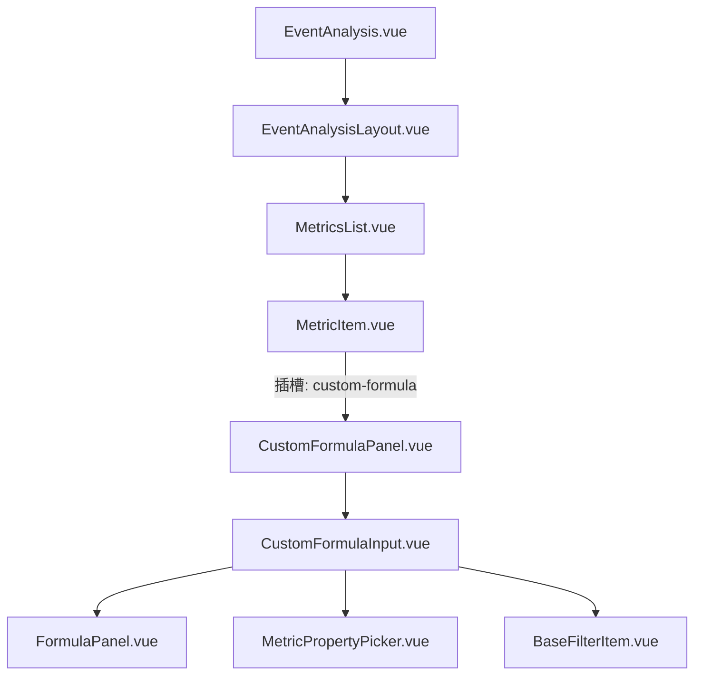

# 组件调用关系图 (Custom Metrics)

本文档展示了 `old_frontend` 中自定义指标相关组件的层级与调用关系。

## 1. 组件层级

## 2. 核心数据流

1.  **用户操作**：在 `CustomFormulaInput` 中添加/删除 Token 或修改指标配置。
2.  **更新通知**：`CustomFormulaInput` 通过 `emit('update:modelValue')` 通知 `CustomFormulaPanel`。
3.  **冒泡同步**：`CustomFormulaPanel` 向上通知 `MetricsList` -> `EventAnalysisLayout` -> `EventAnalysis.vue`。
4.  **状态同步**：`EventAnalysis.vue` 调用 `useCustomFormula.ts` 中的 `syncWebMetricToApiMetric` 函数。
5.  **Payload 生成**：将 UI 状态同步到 `m.custom_metric` 中，准备发送给后端。

## 3. 关键逻辑链路

-   **模式切换**：`useMetricEditing.ts` 负责 `Normal <-> Custom` 的无损转换。
-   **元数据获取**：`useEventMeta.ts` 负责根据事件 ID 获取属性列表。
-   **请求发送**：`useAnalysisRunner.ts` 调用 `usePayloadBuilders.ts` 构建最终请求体。
