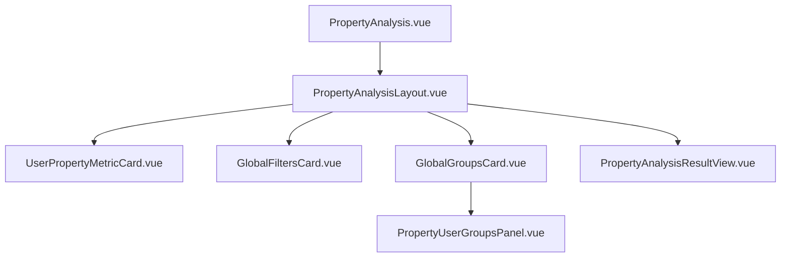

# 用户属性分析 - 核心组件与布局 (old_frontend)

本文档整理了 `old_frontend` 中用户属性分析模块的 UI 组件及其职责。

---

## 1. 组件层级

---

## 2. 核心组件说明

### 2.1 [PropertyAnalysisLayout.vue](file:///d:/gitee/dmp_admin_v2/old_frontend/views/property-analysis/components/PropertyAnalysisLayout.vue)
-   **作用**：属性分析的整体布局容器。
-   **职责**：
    -   管理左侧配置侧边栏（指标、过滤器、分组）。
    -   管理右侧结果展示区域。
    -   处理配置项与主页面的双向绑定（v-model）。

### 2.2 [UserPropertyMetricCard.vue](file:///d:/gitee/dmp_admin_v2/old_frontend/views/property-analysis/components/UserPropertyMetricCard.vue)
-   **作用**：单一指标配置卡片。
-   **职责**：
    -   用户属性搜索（远程搜索）。
    -   根据属性类型（数值、字符、日期）显示可用的聚合公式。
    -   处理“总用户数”这一特殊指标的简化显示。

### 2.3 [PropertyUserGroupsPanel.vue](file:///d:/gitee/dmp_admin_v2/old_frontend/views/property-analysis/components/PropertyUserGroupsPanel.vue)
-   **作用**：人群分群编辑面板。
-   **职责**：
    -   当分组模式切换为“人群分群”时，提供添加/编辑多个分群条件的界面。
    -   支持为每个分群设置别名（Alias）。

### 2.4 [PropertyAnalysisResultView.vue](file:///d:/gitee/dmp_admin_v2/old_frontend/views/property-analysis/components/PropertyAnalysisResultView.vue)
-   **作用**：分析结果渲染。
-   **职责**：
    -   展示图表（ECharts）。
    -   展示带有分页和排序功能的数据表格。
    -   处理“占比”等衍生指标的计算显示。

---

## 3. UI 交互逻辑

-   **属性搜索**：集成远程搜索，自动过滤出当前项目的用户属性元数据。
-   **模式切换**：分组区域支持“维度分组”和“人群分群”的页签切换，两者逻辑互斥。
-   **实时校验**：指标名称、属性选择均为必填项，未配置时“开始分析”按钮保持禁用或提示。
