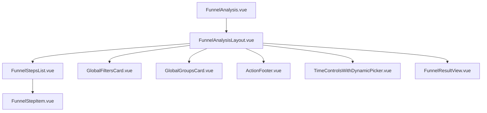

# 漏斗分析 - 核心组件与布局 (old_frontend)

本文档整理了 `old_frontend` 中漏斗分析模块的 UI 组件及其职责。

---

## 1. 组件层级

---

## 2. 核心组件说明

### 2.1 [FunnelAnalysisLayout.vue](file:///d:/gitee/dmp_admin_v2/old_frontend/views/funnel/components/FunnelAnalysisLayout.vue)
-   **作用**：漏斗分析的整体布局容器。
-   **职责**：
    -   管理左侧配置面板（步骤、窗口期、全局过滤、分组）。
    -   管理右侧结果展示面板（时间控制、漏斗图、详细数据）。
    -   协调各子组件之间的事件通信（如点击“开始分析”时触发父组件的查询逻辑）。

### 2.2 [FunnelStepsList.vue](file:///d:/gitee/dmp_admin_v2/old_frontend/views/funnel/components/FunnelStepsList.vue)
-   **作用**：步骤配置区域的主容器。
-   **职责**：
    -   渲染步骤序列。
    -   支持 **拖拽排序** 功能。
    -   管理步骤的添加与删除（受限于 2-8 步的范围）。

### 2.3 [FunnelStepItem.vue](file:///d:/gitee/dmp_admin_v2/old_frontend/views/funnel/components/FunnelStepItem.vue)
-   **作用**：单个漏斗步骤的编辑项。
-   **职责**：
    -   提供事件选择下拉框。
    -   控制步骤内过滤器的展开与折叠。
    -   展示步骤索引（如“步骤 1”）。

### 2.4 [FunnelResultView.vue](file:///d:/gitee/dmp_admin_v2/old_frontend/views/funnel/components/FunnelResultView.vue)
-   **作用**：分析结果展示区域。
-   **职责**：
    -   渲染 **漏斗可视化图表**（柱状图样式）。
    -   展示 **总体转化率** 与 **步骤转化率**。
    -   渲染详细数据表格。

---

## 3. UI 交互逻辑

-   **步骤重排**：用户可以通过拖拽 `FunnelStepItem` 改变步骤顺序，父组件会接收 `reorder` 事件并同步更新表单状态。
-   **动态步骤名生成**：当 `FunnelStepItem` 中的事件被修改时，系统会自动将 `name` 字段更新为 `${eventName}`，作为该步骤的标题。
-   **窗口期控制**：转化窗口期以“天”为单位，默认值为 1 天，范围 1-90 天。
-   **局部过滤器**：每个步骤下方都可以展开一个 `MetricFilterEditor`，用于针对该步骤添加属性筛选。
