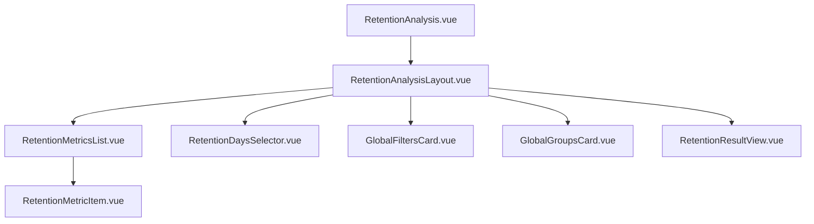

# 留存分析 - 核心组件与布局 (old_frontend)

本文档整理了 `old_frontend` 中留存分析模块的 UI 组件及其职责。

---

## 1. 组件层级

---

## 2. 核心组件说明

### 2.1 [RetentionAnalysisLayout.vue](file:///d:/gitee/dmp_admin_v2/old_frontend/views/retention/components/RetentionAnalysisLayout.vue)
-   **作用**：留存分析的整体布局组件。
-   **职责**：
    -   组织配置区域（指标、天数、过滤、分组）。
    -   管理分析结果的展示区域。
    -   控制分析执行的触发逻辑。
    -   提供报表保存入口。

### 2.2 [RetentionMetricsList.vue](file:///d:/gitee/dmp_admin_v2/old_frontend/views/retention/components/RetentionMetricsList.vue)
-   **作用**：配置初始事件和结束事件。
-   **职责**：管理两个关键指标的选择。

### 2.3 [RetentionMetricItem.vue](file:///d:/gitee/dmp_admin_v2/old_frontend/views/retention/components/RetentionMetricItem.vue)
-   **作用**：单个事件指标配置项。
-   **职责**：选择事件、配置指标类型、指标内过滤器。

### 2.4 [RetentionDaysSelector.vue](file:///d:/gitee/dmp_admin_v2/old_frontend/views/retention/components/RetentionDaysSelector.vue)
-   **作用**：配置需要分析的第 N 天。
-   **职责**：提供可视化输入和删除留存天数的功能。

### 2.5 [RetentionResultView.vue](file:///d:/gitee/dmp_admin_v2/old_frontend/views/retention/components/RetentionResultView.vue)
-   **作用**：结果展示区域。
-   **职责**：
    -   渲染留存率趋势图。
    -   渲染留存数据表格（通常为“留存矩阵”）。
    -   支持留存率与留存用户数的切换展示。

---

## 3. UI 交互逻辑

-   **配置变更**：所有配置项通过 `emit` 向上层冒泡同步。
-   **实时响应**：大部分配置项变更后，不自动执行分析，需点击“开始分析”按钮手动触发。
-   **加载状态**：在分析执行过程中，结果区域显示 Loading。
-   **空状态处理**：未执行分析或无结果时，展示对应的提示。
